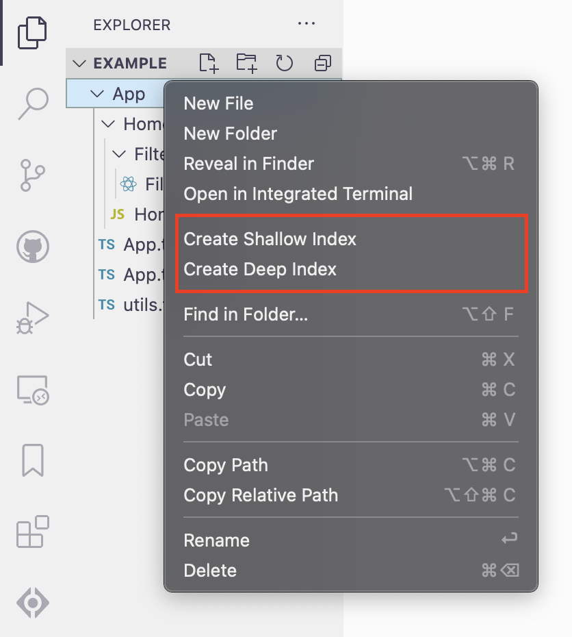
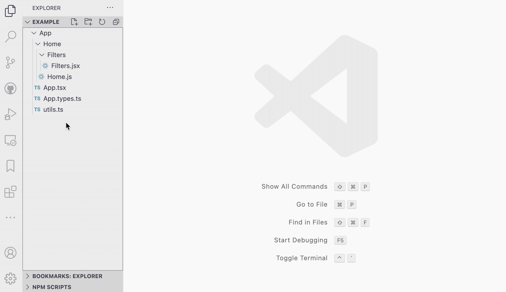
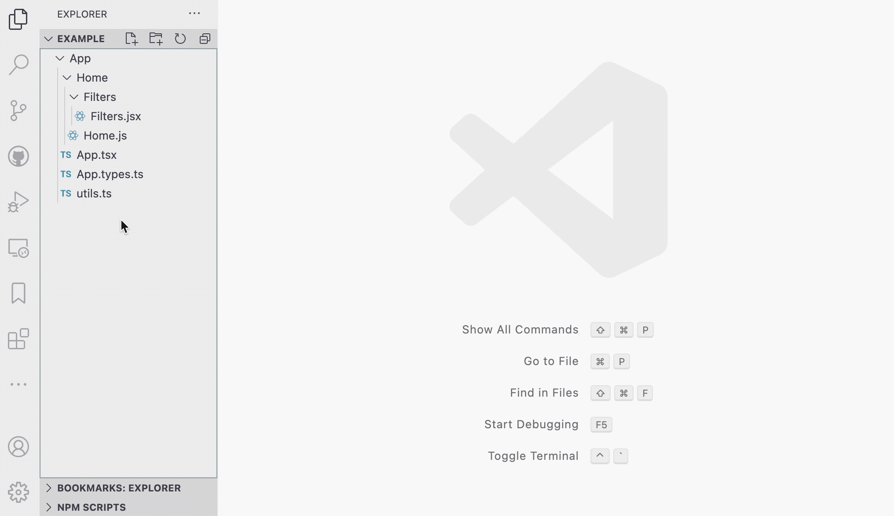
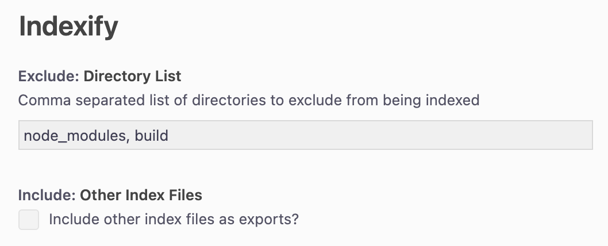

# Indexify

Index files (`index.js`/`index.ts`) act as a directory's table of contents. They are great for tracking exportable functions and variables. They allow you to easily import them into your codebase without having to dig them up from buried sub-directories.

The only problem is manually keeping track of all your exports and updating index files. That's where **Indexify** comes in!

Indexify adds options to your context menu to auto-generate index files on the fly. All you have to do is right-click on any directory in the explorer and select either a **shallow index** (indexes only the root of the selected directory) or a **deep index** (indexes all nested directories)

 

 
 

## Features

These are some of the key features:

- create an index file from your explorer context menu (or command palette if you prefer that approach)
- automatically determines whether to generate an `index.js` or an `index.ts` file.
- supports `*.js`, `*.jsx`, `*.ts`, `*.tsx` file formats
- supports required exports format (e.g. `module.exports = ...`)
- supports static exports format (e.g. `export const example = ...`)
- supports Typescript types (e.g. `export type Example = {}`, `export interface Example {}`)
- exports default & anonymous variables as the name of the variable's parent directory

 

### Shallow Indexing

Creating a shallow index will only include files in the root of the selected directory. All sub-directories within the selected folder will be ignored.

 

 
 

### Deep Indexing

Creating a deep index will analyze all files and directories within the selected folder (no matter how deeply nested your files are - they'll be indexed!).

 

 
 

## Extension Settings

Indexify has the following optional settings:

- `indexify.exclude.directoryList`: comma separated list of directories to exclude from being indexed (default: `node_modules, build`)
- `indexify.include.otherIndexFiles`: include other index files as exports? (default: `false`)

 

